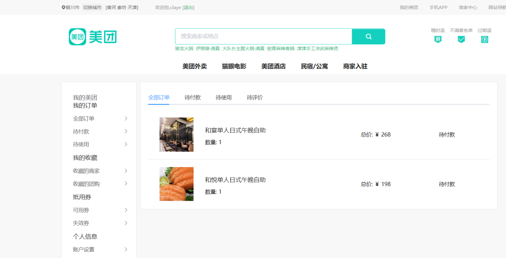

# Vue重构美团电商网站

## 项目简介

​		该网站是采用数据驱动模型的Vue框架搭建而成，在业务上分为首页、登陆/注册、产品列表、产品详情、购物车、订单等页面。在技术内容方面主要使用了**Nuxt.js**、**Koa2**。两者之间采用**SSR( Vue Server Renderer)**进行交互。数据状态的同步使用了**Vuex**。在前端技术方面，采用了最新的Vue2.5的语法，在脚手架上使用了**Vue-Cli3**。后端技术方面采用**Koa2**，数据缓存及数据库采用了**Redis**和**MongoDB**。同时，还采用了数据对象模型管理工具**Mongoose**。

​		业务技术细节方面，该平台开发了登陆/注册，SMTP服务，城市服务、推荐服务、搜索服务、地图服务、购物车、订单设计、组件的复用设计、接口设计、数据对象模型等模块，使之可以成为一个独立完成的网站系统。


## 目录结构


## 网站展示

### 平台首页

​		首页部分由导航栏、搜索栏、菜单栏、商品陈列栏、底部信息五部分组成。其中，导航栏包含城市定位及切换城市功能、用户的登陆/注册以及静态的导航菜单栏。其具体样式如图所示。


​		搜索栏包括平台logo（静态），搜索栏的功能与实现，以及平台保障信息的展示。其具体样式如图所示。


​		菜单栏包含菜单栏的展示，菜单轮播图，用户登录注册接口。具体样式如图所示。


​		商品陈列栏为热门商品信息的陈列与展示。具体样式如图5.6所示。


​		底部栏为平台底部信息的展示，均为静态信息资源，具体样式如图所示。


### 用户登录、注册

1. 用户登录

   ​		当users表中存有用户数据时，点击平台登录接口，具体样式如图所示，即可登录用户，平台系统将自动把用户登录状态信息利用Redis服务器植入浏览器的cookie中。

   

2. 用户注册

   ​		当进入用户注册界面时需填写注册用户所必须的信息，浏览器在前台验证所填信息的完整性及正确性（如email格式是否正确，两次输入密码是否一致等）。具体的用户注册界面如图所示。

   

### 城市选择页

​		当用户所期望的城市与用户所在城市不一致时，可手动切换所在城市。在切换城市页面中，用户可直接以省份>城市的方式选择想切换的城市，也可以通过输入框搜索直接搜索城市（目前仅支持中文形式的搜素）。如果以上方式均达不到要求，也可使用英文首字母索引的方式，快速切换至城市所在的列表，具体样式如图所示。


### 商品列表页

​		当用户点击菜单或搜索商品时，浏览器向后台请求数据并将页面切换至相应的页面，具体样式如图所示。


### 商品详情页

​		当用户点击商品列表页的任意商品时，页面会切换至商品详情页，并展示可供用户购买的商品信息，具体样式如图所示。


### 购物车

​		当用户在系统点击购买商品时，系统会自动创建购物车并将所选商品添加至购物车中，具体页面样式如图所示。


### 订单详情页

​		当用户在购物车选择商品数量，并点击提交订单后，平台会自动生成订单并将页面切换至订单详情页，具体页面样式如图所示。




## 网站功能展示

### 注册、登陆功能测试

​		切换至用户注册界面输入信息，将邮箱格式输入错误，发现系统页面输出提示信息，如图所示，邮箱格式验证功能良好。


​		继续向下输入，将两次密码设置为不相同，系统提示错误，密码一致性功能良好，如图所示。


​		将所有信息填写正确，点击发送验证码。邮箱接收到用户注册验证码邮件，用户注册验证功能良好，具体内容如图所示。


​		切换至用户登录界面，将刚才所注册的用户进行登录测试，登陆成功，登录接口功能良好，具体流程如图所示。


### 城市定位切换测试

​		进入城市定位切换界面，选择省份>城市（在省份未选择前城市项不可用），切换城市成功，通过测试，如图所示。


​		在搜索框内输入哈尔滨，列表框提示信息，点击切换，城市切换成功。具体流程如图所示。


​		在字母导航栏中点击城市，城市切换成功。具体流程如图所示。


### 搜索框测试

​		在首页搜索框中添加搜索信息，搜索框弹出提示。点击搜索按钮，页面切换至商品列表页，搜索功能良好。具体流程如图所示。


### 商品购买流程测试

​		点击商品列表，进入列表详情页，点击商品购买进入购物车页面，选择两个商品数量点击下单，创建订单页面，具体流程图如图所示。


​		数据库购物车数据及订单数据如图所示。


## 构建项目

``` bash
# install dependencies
$ npm install

# serve with hot reload at localhost:3000
$ npm run dev

# build for production and launch server
$ npm run build
$ npm start

# generate static project
$ npm run generate
```

**注**：项目运行前请先运行Redis和MongoDB服务，Mongo数据表数据在项目目录data文件夹下，利用`mongod --dbpath './data'`命令执行


##### 联系我：1269575798@qq.com
